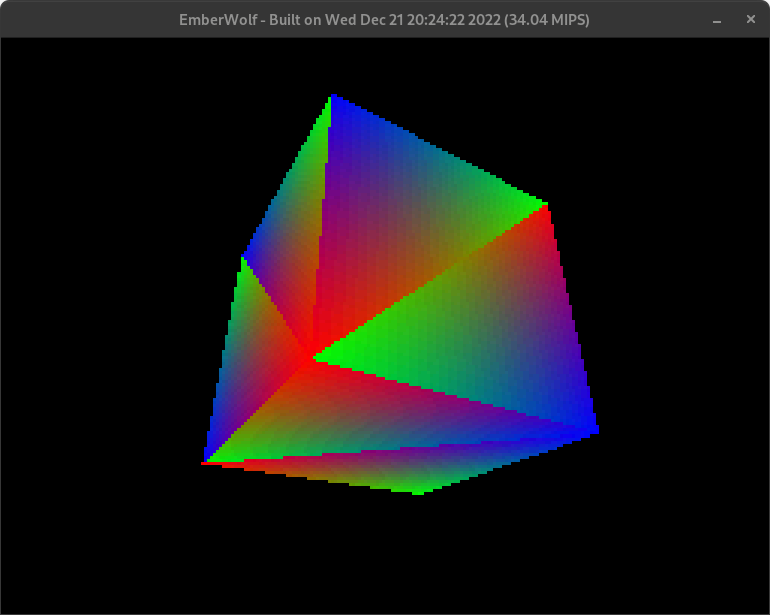

# EmberWolf

EmberWolf is a fantasy console which takes huge inspiration from early 3D Consoles.    
EmberWolf features a 32-bit RISC-V CPU clocked at 33.8688 MHz, a powerful, fixed-function GPU, 4 MiBs of RAM, a 96 KiB Geometry Cache, and a 1 MiB Texture Cache.

## Build Instructions will be added soon!