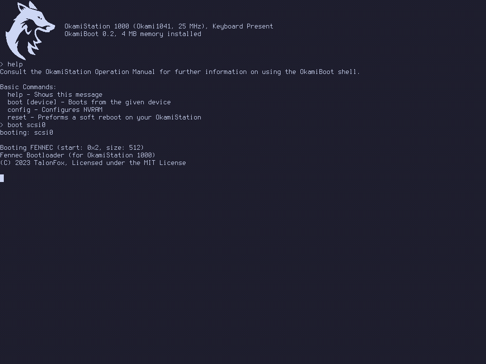

<h1 align-center="true">&nbsp;&nbsp;OkamiStation</h1>

Inspired by ry's [fox32](https://github.com/fox32-arch/fox32) and hyenasky's [XR/Station](https://github.com/xrarch/xremu), OkamiStation is a fantasy computer taking ideas and design decisions from late 80s UNIX workstations.    
It features the Okami1041 processor, a MIPS R3000 inspired processor built from scratch. Along side it an assembler and a custom programming language (known as Okameron) for developing software for the processor.    
OkamiStation also features 4 MiB of RAM (you can change this), a 1024x768 pixel 8-bit framebuffer, support for up to 7 SCSI Drives, the Okami Input Peripheral Bus (OIPB) for the keyboard and mouse, and a 1000 Hz periodic timer. (support for audio and a floppy disk drive will be coming in the near future)    

## Building and Running
> Note: OkamiStation is not complete yet, these instructions are subject to change

```sh
$ git clone --recursive https://github.com/TalonFox/OkamiStation
$ cd OkamiStation/okamisdk
$ make
$ cd ../firmware
$ make
$ cd ../emulator
$ make
$ cd ../Fennec
$ make run
```
That's it...

## Screenshots
> There's not really much to show off rn



## Discord Server

<a href="https://discord.gg/Jw7Te5FaVS"></a>